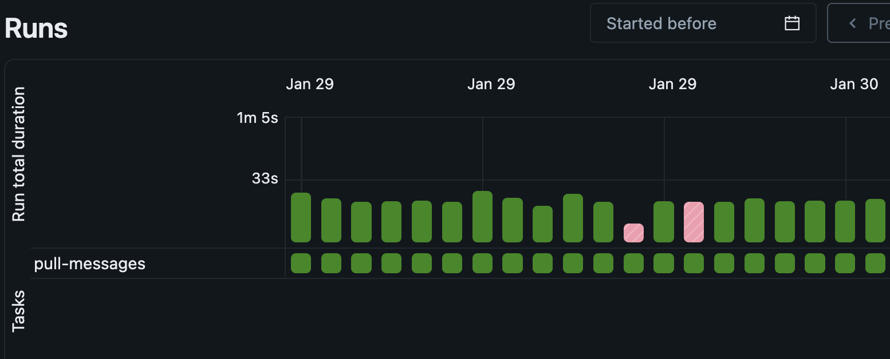
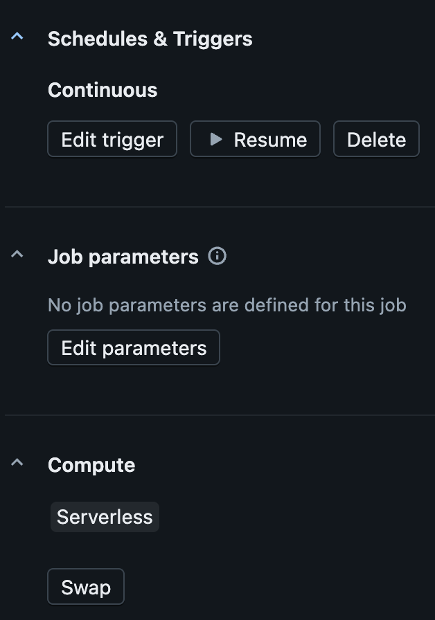
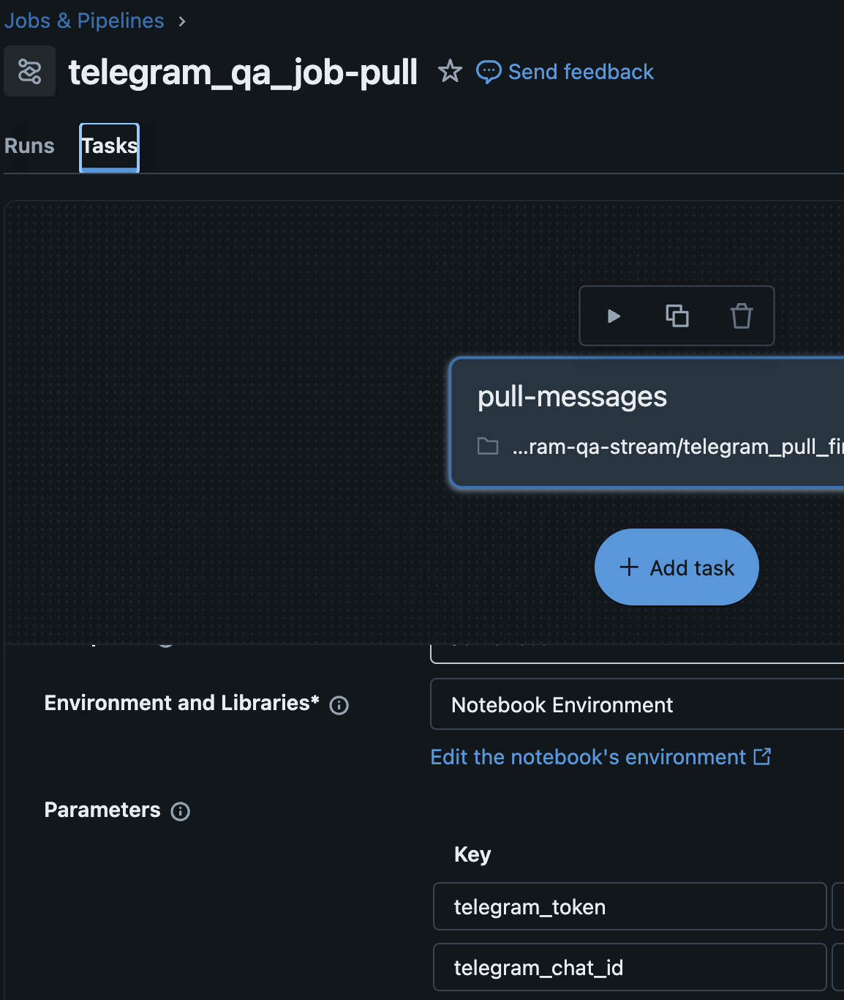

# Telegram Channel Message Fetcher

This utility script interacts with the Telegram Bot API to fetch and store messages from a specific channel. It includes a persistent **offset management system** to ensure no messages are missed or duplicated between runs.


## 🚀 How it Works

The script follows a simple "Fetch-Process-Save" cycle designed to be run as a scheduled job (e.g., in Databricks or via Cron).

1.  **Load Offset:** The script checks a local file (`OFFSET_FILE`) to see where it left off.
2.  **API Request:** It calls the Telegram `/getUpdates` endpoint. If an offset exists, it only requests messages newer than that ID.
3.  **Data Extraction:** It filters the API response specifically for `channel_post` objects, extracting key metadata (Text, Date, Chat ID).
4.  **Local Storage:**
    * Saves the extracted messages into a timestamped `.json` file.
    * Updates the `OFFSET_FILE` with the next available ID for the next run.

## 📂 Code Structure

### Offset Management
| Function | Description |
| :--- | :--- |
| `load_offset()` | Reads the last processed ID from disk. Returns `None` if the file doesn't exist. |
| `save_offset(int)` | Writes the new `update_id + 1` to disk to mark progress. |

### Core Logic
* **`get_channel_messages(offset)`**: Performs the HTTP GET request to Telegram. Uses `response.raise_for_status()` to catch API errors early.
* **`run_once()`**: The main orchestrator. It handles directory creation, message parsing, and JSON serialization.

## 🛠 Usage

Ensure you have defined the following constants in your environment/notebook before running:
* `BASE_URL`: Your Telegram Bot API URL (containing your Bot Token).
* `OFFSET_FILE`: Path to the file storing the integer offset.
* `DATA_DIR`: Directory where JSON results will be saved.

```python
# To execute the fetcher:
if __name__ == "__main__":
    run_once()
```

### Data Output Format
The script generates JSON files with the following structure:
```JSON
[
  {
    "update_id": 123456789,
    "message_id": 42,
    "channel_id": -1001234567,
    "channel_title": "My Awesome Channel",
    "text": "Hello World!",
    "date": 1672531200
  }
]
```

### Triggering
On Databricks, I initially triggered it via a continuous pipeline so I was pulling messages every minutes.
The token & chat id were passed using the job parameters in the UI.

<p align="center">
    
    
    
 </p>