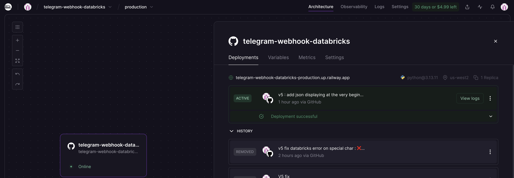
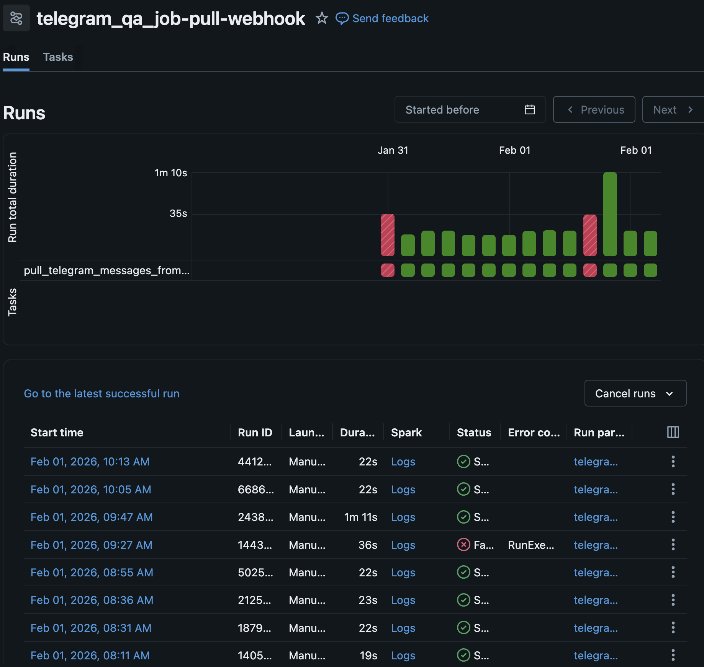
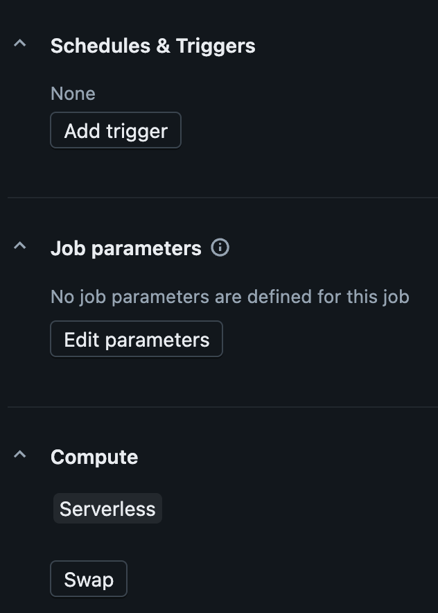
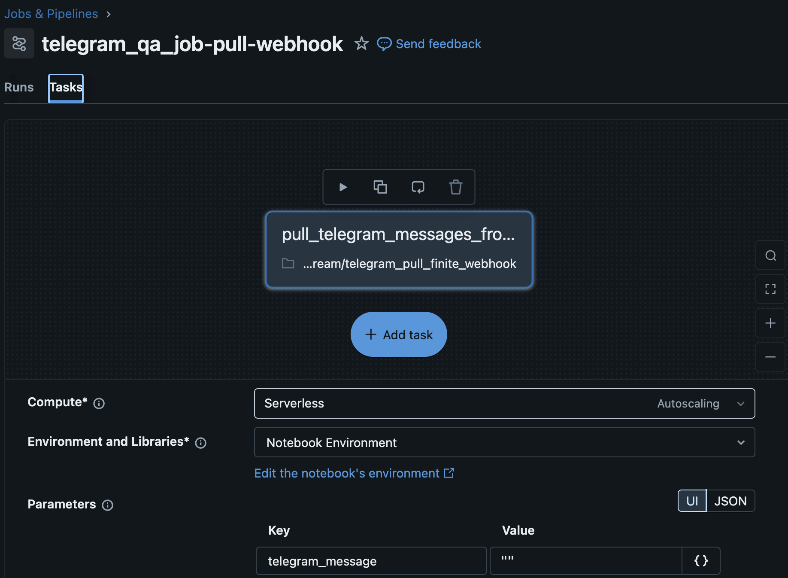

# Telegram Webhook & Databricks Integration

This project implements a reactive, cost-efficient pipeline to ingest Telegram messages into a Databricks Bronze layer.

## 🏗 Architecture Evolution

Initially, this project used a continuous polling loop (`getUpdates`) launched by a continuous job on Databricks. To reduce cloud costs, it has been refactored to a **Webhook Architecture**:

1.  **Telegram** sends a POST request to a **FastAPI** app (hosted on Railway) the moment a message is sent.
2.  **Railway App** encodes the payload into Base64 (to ensure safe transmission of special characters/emojis).
3.  **Databricks Job** is triggered via API, receiving the message as a notebook parameter.
4.  **Databricks Notebook** decodes the data and saves it to the Lakehouse (volume).

---

## 🛠 Component 1: The Railway Webhook (FastAPI)

The FastAPI server acts as a bridge. It listens for Telegram updates and triggers the Databricks REST API.

* **Endpoint:** `/telegram-webhook`
* **Security:** Uses environment variables for Databricks Tokens and Instance URLs.
* **Key Logic:** It uses `base64.b64encode` on the incoming JSON to prevent string formatting issues when passing parameters to Databricks.

---

## 📊 Component 2: The Databricks Notebook (Ingestor)

This notebook is now a "Short-Lived Job" instead of a continuous stream.

### Data Flow:
1.  **Widget Input:** Receives `telegram_message` as a Base64 string.
2.  **Decoding:** ```python
    decoded_bytes = base64.b64decode(raw_input)
    full_data = json.loads(decoded_bytes.decode("utf-8"))
    ```
3.  **Schema Mapping:** Extracts `update_id`, `message_id`, `text`, and `author_signature`.
4.  **Persistent Storage:** Saves files to the Unity Catalog Volume: `/Volumes/workspace/telegram_qa/raw_telegram/data/`.

> **Note on Offsets:** In this Webhook mode, `offset` management is handled automatically by Telegram. Once Telegram receives a `200 OK` from our Railway app, it considers the message delivered and won't send it again.

---

## ⚙️ Setup & Triggering

### 1. Set the Webhook
To point Telegram to your Railway app, run:
```bash
curl -X POST "[https://api.telegram.org/bot](https://api.telegram.org/bot)<YOUR_TOKEN>/setWebhook" \
     -d "url=https://<your-railway-app-url>/telegram-webhook"
```
The response will be :
```JSON
{"ok":true,"result":true,"description":"Webhook was set"}
```

### 2. Configure your railway app
<p align="center">
    
    
 </p>

### 3. configure your Databricks job
<p align="center">
    
    
    
 </p>