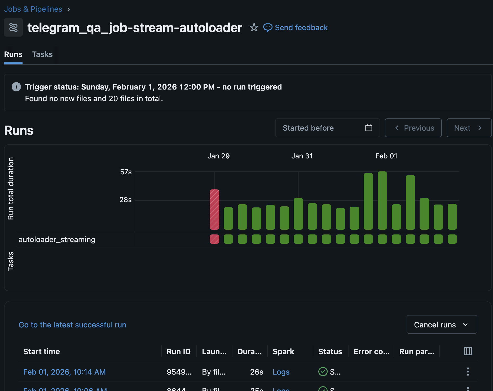
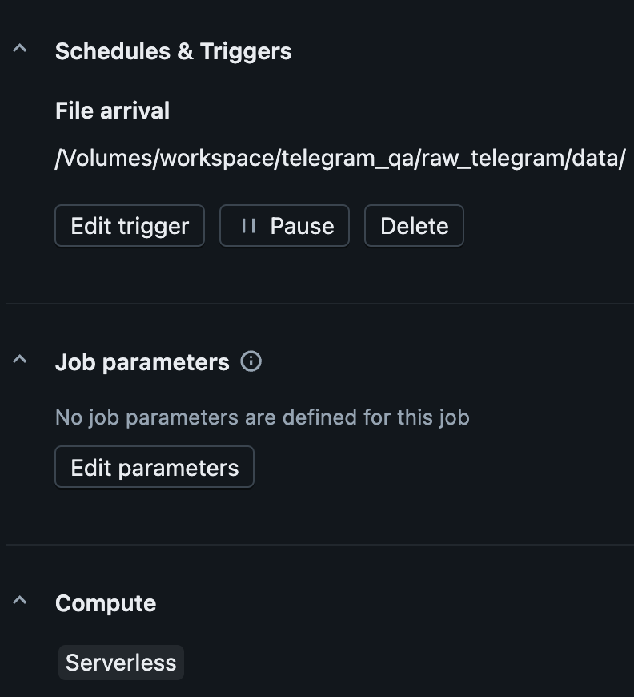

## 🌊 Data Engineering: The Bronze Layer (Streaming)

The ingestion process uses **Databricks Auto Loader (cloudFiles)** to transform raw JSON files into a structured Delta Lake table.

### 🔑 Key Features

* **Auto Loader (`format("cloudFiles")`)**: Efficiently tracks new files arriving in the Volume without expensive file listing. It automatically handles the queueing of incoming Telegram JSONs.

* **Schema Enforcement**: By applying `telegram_schema`, we ensure that only valid data enters our Bronze table, maintaining high data quality from the first hop.
* **Metadata Enrichment**: Every row is decorated with:
    * `_ingested_at`: The exact time of processing.
    * `_source_file`: The specific JSON file name (via `_metadata.file_path`) for 100% data lineage and easier debugging.

### ⚙️ Efficient Processing with `availableNow=True`

Instead of running a cluster 24/7 (Continuous mode), this pipeline uses:
`.trigger(availableNow=True)`

**Why this matters:**
1.  **Cost:** It processes all messages that arrived since the last run in one batch and then **shuts down the cluster**.
2.  **State Management**: The `checkpointLocation` ensures that even if the job is triggered multiple times by the Railway webhook, it knows exactly which files it has already processed, guaranteeing **Exactly-Once** semantics.
3.  **Scalability**: If 100 messages arrive while the cluster is starting up, Auto Loader will pick them all up in a single micro-batch.

### 🏗 Data Lineage
| Layer | Format | Storage Path |
| :--- | :--- | :--- |
| **Raw** | JSON | `/Volumes/.../raw_telegram/data/` |
| **Bronze** | Delta Table | `workspace.telegram_qa.bronze_telegram_messages` |
| **Checkpoint**| Metadata | `/Volumes/.../checkpoints/autoloader/` |

### Pipeline overview 

    
    
 
