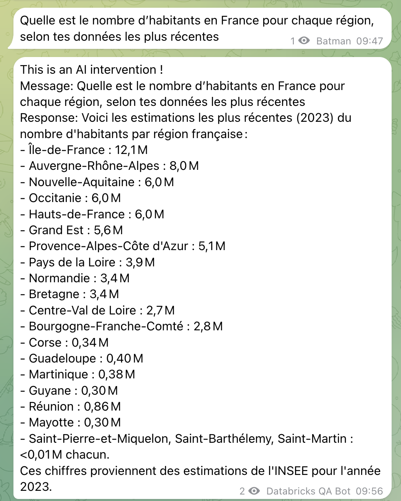
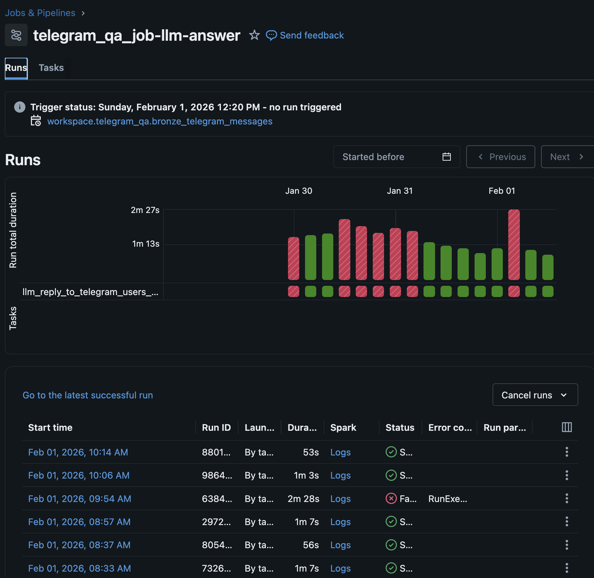
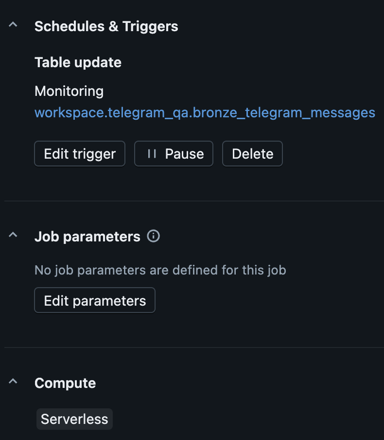
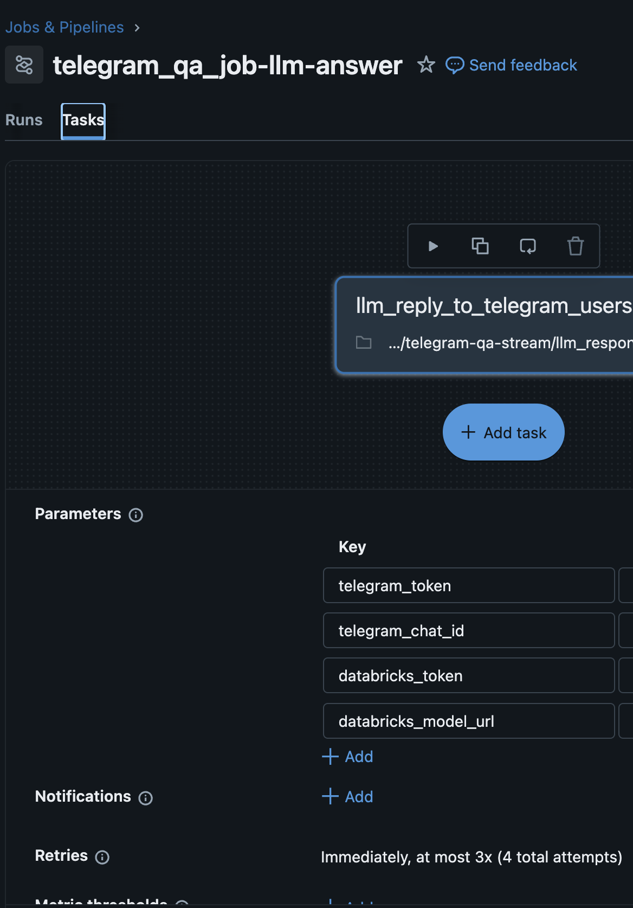
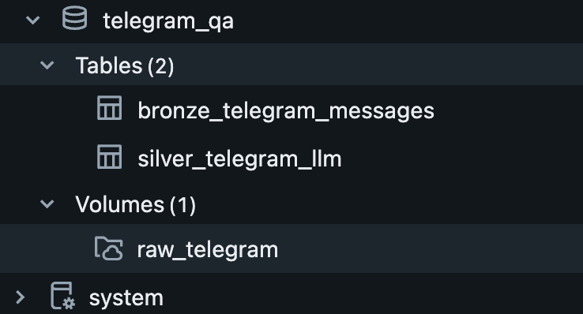

## 🧠 The "Silver" Layer: LLM Orchestration with `foreachBatch`

This is the most critical part of the pipeline. Since Spark is a distributed system, we use the `.foreachBatch()` sink to process micro-batches of messages through the LLM.

### 🚀 Implementation Highlights

* **Pandas Conversion:** We convert the micro-batch to a Pandas DataFrame (`toPandas()`) to leverage the OpenAI SDK and standard Python libraries for the AI response generation.
* **Closure-Safe Imports:** Libraries and clients are initialized inside the `process_batch` function to ensure they are available on all Spark executor nodes.
* **Dual-Action Pipeline:** In a single pass, the system:
    1. Generates an AI response using **Databricks Foundation Models**.
    2. Sends a real-time reply back to the user via the **Telegram API**.
        <p align="center">
            
            
        </p>
    3. Persists the enriched data (User message + AI answer) into the **Silver Delta Table** for long-term storage and audit.

### 🛠 The Orchestration Logic (Simplified)

```python
def process_batch(df, batch_id):
    # Skip empty batches to save compute
    if df.count() == 0: return

    # Bridge Spark to Python
    pdf = df.toPandas()
    
    for _, row in pdf.iterrows():
        # 1. Generate AI Response
        llm_response = ai_answering(row["text"])
        
        # 2. Send real-time callback to Telegram
        send_telegram_message(llm_response)

        # 3. Collect data for Silver Table
        rows.append({ ... })

    # Write back to Delta Lake (Silver Table)
    df_silver = spark.createDataFrame(rows, schema=silver_schema)
    df_silver.write.format("delta").mode("append").saveAsTable("silver_telegram_llm")
```

## ⚙️ Engineering Trade-offs & Optimization

### 💡 Design Choice: The "Small Data" Strategy
In the `process_batch` function, I intentionally converted the Spark micro-batch to a Pandas DataFrame (`toPandas()`). 

**The Reasoning:**
Because Telegram messages arrive individually or in small clusters, the data volume per batch is low. Converting to Pandas allowed me to:
1. Use the **native OpenAI/Requests SDKs** without the complexity of writing custom Spark UDFs.
2. Maintain lower latency for real-time responses.

> **Portfolio Tip:** If this pipeline were scaled to millions of messages per second, the next architectural evolution would be to move from `toPandas()` to **Spark Pandas UDFs (Vectorized UDFs)**. This would allow the LLM calls to be parallelized across the entire cluster's CPU/GPU resources rather than processing them on the driver node.

### 🚀 Performance Improvements
* **Broadcast Variables:** For a production version, the Telegram Token and API URLs should be handled as Spark Broadcast variables to ensure they are efficiently shared across executors.
* **Error Handling:** The current `try-except` blocks ensure the stream doesn't crash on a single malformed message, allowing the job to continue processing the rest of the batch.
* **Checkpointing:** I used a persistent checkpoint directory to guarantee that if the Databricks job is interrupted, it resumes exactly where it left off, ensuring no message is ever double-processed or lost.


## Code explanations 
The process_batch function is the core of the AI pipeline. It is called by Spark’s foreachBatch sink, acting as the bridge between distributed big data and sequential API calls.

1. process_batch(df, batch_id)
This is the entry point for every micro-batch of data.
 * The Bridge: It uses df.toPandas() to convert Spark's distributed rows into a local Pandas DataFrame. This allows us to use standard Python libraries like requests and openai which are not natively distributed.
 * Closure Strategy: Note that import statements are placed inside this function. This ensures that every Spark worker node has the necessary libraries loaded during execution.

2. ai_answering(user_message)
This function manages the interaction with the Databricks Foundation Model (DaaS).
 * Prompt Engineering: It uses a strictly formatted JSON prompt to ensure the LLM output is predictable and easy to parse.

 * Safety Logic: It includes fallback responses ("Sorry, I don't know...") to handle edge cases where the LLM might fail or provide an empty response, ensuring the pipeline never breaks.

 * JSON Parsing: It handles the conversion from the LLM's raw text back into a structured Python dictionary.

3. send_telegram_message(text)
This is the "Callback" function that closes the loop with the user.

 * HTTP POST: It sends the LLM-generated answer back to the Telegram API.

 * Decoupling: By keeping this separate, we can log whether the message was sent successfully without failing the entire data ingestion job.

4. sanitize_row(row)
Data quality is paramount in the Silver layer.

* Type Casting: This function forces every piece of data into its correct format (e.g., ensuring IDs are int and messages are str).

* Data Integrity: If a row is corrupted or missing vital information, this function returns None, and the pipeline filters it out. This prevents "poison pills" from crashing your Delta table.

5. foreachBatch Execution
The final block connects the logic to the stream:
```python
.foreachBatch(process_batch)
```
 * Exactly-Once Processing: By using .option("checkpointLocation", ...), Spark ensures that if the job fails halfway through a batch, it knows exactly where to restart, preventing the LLM from answering the same message twice.

* Batch Isolation: Each batch is treated as a single unit of work—if the LLM fails for one batch, the Bronze data remains safe and ready for a retry.

### Pipeline & Catalog images
<p align="center">
    
    
    
    
 </p>